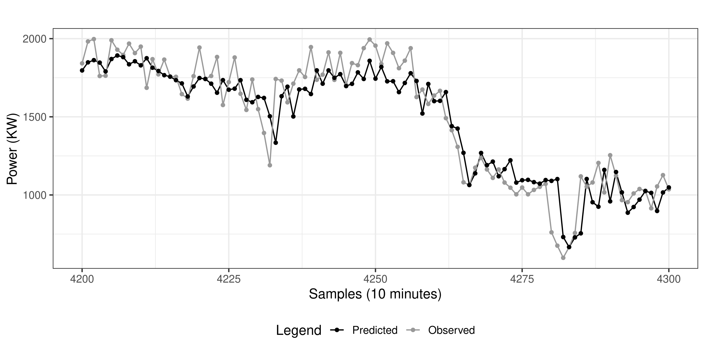
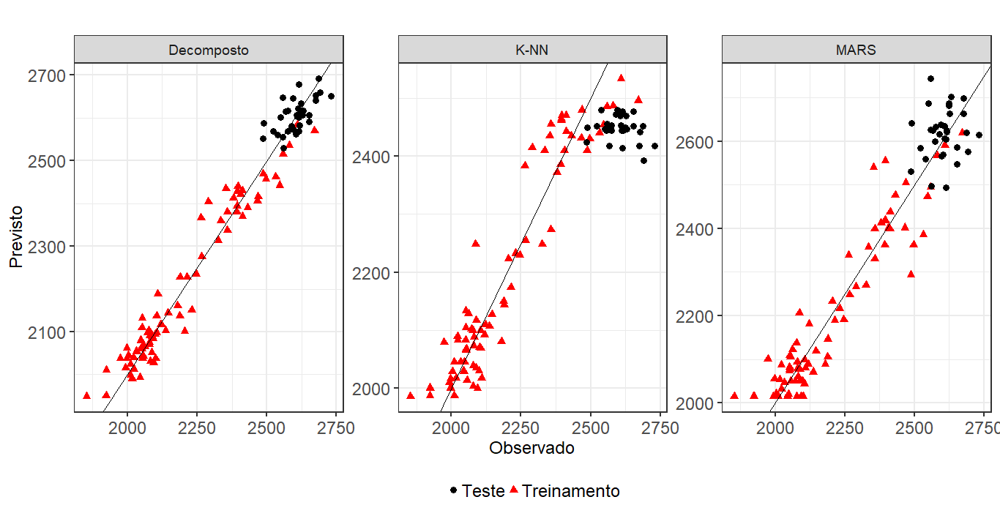

# Publication in 14th Brazilian Computational Intelligence Meeting (CBIC)
## :zap: Very short-term wind energy forecasting based on stacking ensemble



### Code
- [Wind repository file](Wind)

### Publication
- [Preprint (ResearchGate)](https://www.researchgate.net/publication/336991055_Very_short-term_wind_energy_forecasting_based_on_stacking_ensemble)
- [Conference paper (2019 CBIC proceedings)](http://abricom.org.br/eventos/cbic2019/cbic-paper-22/)

### How to cite this paper
````bibtex
@inproceedings{moreno2019very,
author={Moreno, Sinvaldo Rodrigues and da Silva, Ramon Gomes and Ribeiro, Matheus Henrique Dal Molin and Fraccanabbia, Naylene and Mariani, Viviana Cocco and Coelho, Leandro Santos},
booktitle={14th Brazilian Computational Intelligence Meeting (CBIC)},
title={Very short-term wind energy forecasting based on stacking ensemble},
year={2019},
pages={1--8},
month={November},
address={Belem, Brazil},
doi={10.21528/CBIC2019-22}
}
````

----

## (Rejected) :oil_drum: Previsão da produção brasileira de petróleo com base em uma abordagem híbrida



### Code
- [Oil repository file](Oil)
